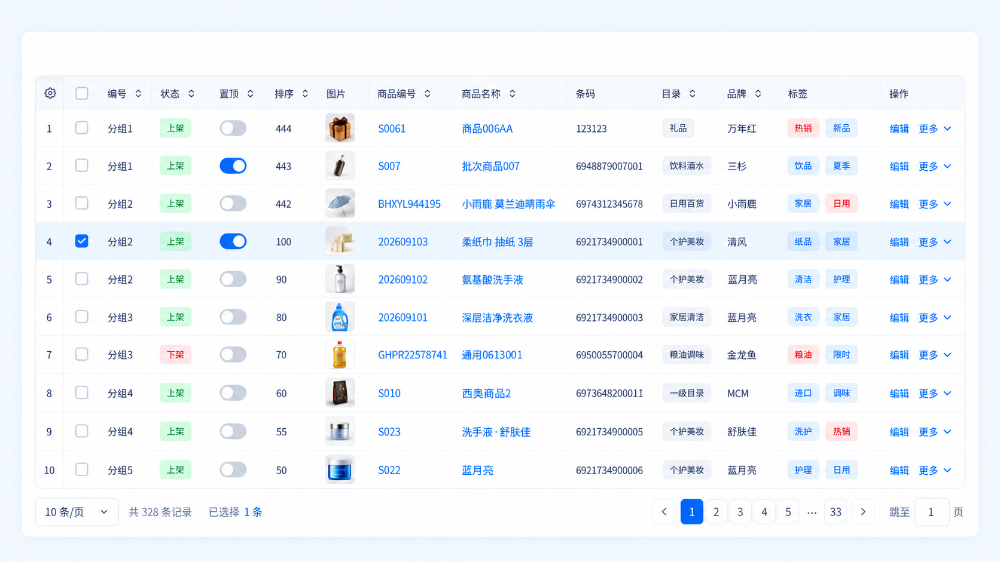

# ApexTableReact 组件库规格说明

规格日期：2026-09-14。目标版本：首个可发布版本。依据：40 项访谈决策，以及同日用户追加确认的原生 API 原则和 React 最新稳定版升级要求；追加确认优先于原访谈中冲突的封装方案。

本文件定义后续实现和验收要求。访谈与规格编写已经完成，组件实现、性能实测、业务接入及 npm 发布属于后续工作；文中的性能数值是发布门槛，不是已取得的测试结果。

“用户确认”指访谈中选定的产品决策；标记为“工程默认”的数值和协议细节，是在这些决策内补齐的实施约定，可以在实现评审中调整并同步本规格，不能据此扩大首版范围或降低用户确认的验收门槛。

## 1. 目标、定位与参考界面

构建基于 `@tanstack/react-table` 的 React 表格组件库，服务公司内部的商品、订单、配置等平铺业务列表。借鉴 AG Grid 的表格使用方式，提供可控样式、稳定交互和可验证的性能。允许整理通用能力后公开发布 npm，并按公开开源组件库维护。

业务接入使用 TanStack 原生列、数据、实例、状态和回调，结合 Apex 的主题与插槽得到完整业务表格。已有 TanStack 知识和代码可直接复用；快速开始提供必要特性的原生配置示例，用户只需额外学习 Apex 的界面与交互扩展。

### 1.1 参考图

保留参考图的白底、浅蓝表头、细边框、蓝色交互、选中行浅色高亮和底部分页组织方式。按真实业务密度调整，不进行逐像素复刻。外层页面背景、大面积留白和装饰不属于表格默认布局要求。

截图中的图片、商品链接、状态标签、开关、编辑与更多菜单属于业务单元格示例；“置顶”是业务字段，不自动启用行固定，也不擅自改变行顺序。“分组 1”等文本只作为普通值，不推导出分组行功能。

### 1.2 核心使用场景

| 场景           | 应达到的结果                                                                    |
| -------------- | ------------------------------------------------------------------------------- |
| 服务器业务列表 | 查询、排序和分页由服务端完成；切换查询立即显示骨架；跨页累计已明确选中的行 ID   |
| 本地数据查看   | 浏览器持有 1 万～ 10 万行，通过固定行高虚拟滚动浏览，本地执行基础筛选和单列排序 |
| 公司主题接入   | 更换主题 CSS、变量、类名样式和插槽即可调整外观，保留布局与交互正确性            |
| 个性化列布局   | 用户设置显隐、顺序、宽度和固定位置，按明确身份范围保存并在列结构变化后正确恢复  |

## 2. 仓库现状与技术基线

### 2.1 已核实的现状

| 项目             | 当前值                                                                                         | 实施要求                                                                                           |
| ---------------- | ---------------------------------------------------------------------------------------------- | -------------------------------------------------------------------------------------------------- |
| 文档与构建       | dumi 2、father 4、pnpm                                                                         | 延续当前体系，验证实际 ESM 与 CSS 产物                                                             |
| TypeScript       | `5.9.3`，`strict: true`，`jsx: react-jsx`                                                      | 使用现代 JSX 转换；显式开发依赖满足 React 类型及文档国际化依赖要求，公开类型不得依赖 dumi 临时文件 |
| React 开发依赖   | React / React DOM 与对应 `@types` 均为 `19.3.0`                                                | 2026-09-14 核实的 npm 最新稳定版；后续升级重新核对，不使用 canary/RC                               |
| React peer 声明  | React / React DOM 均为 `^18.0.0 \|\| ^19.0.0`                                                  | 开发使用 19.3.0，发布前仍须验证 React 18/19 消费；不以 peer 声明代替测试结果                       |
| 文档依赖兼容     | dumi `2.4.49`、father `4.6.37`；限定文档依赖为 react-intl `7.1.14`、react-helmet-async `3.0.0` | overrides 仅作用于 dumi/Umi 对应依赖边，解决 React 19 peer 范围；不得进入组件运行时包              |
| TanStack Table   | 已安装 `9.2.4`，声明 `^9.2.4`                                                                  | 基于 v9 原生 API，依赖升级必须经过回归                                                             |
| TanStack 包约束  | React `>=18`，Node `>=20`，ESM                                                                 | 与消费项目和构建环境保持一致                                                                       |
| 当前本地工具     | Node `22.23.1`、pnpm `11.21.0`                                                                 | 仅作为规格核查环境记录，不代表性能基准环境                                                         |
| 代码起点         | `src/Foo` 示例组件                                                                             | 后续新增正式表格模块并替换示例入口                                                                 |
| 发布配置与许可证 | `publishConfig.access: public`、MIT                                                            | 允许公开发布；沿用当前 MIT 声明并补齐公开包资料                                                    |

本次升级基于已有用户暂存修改继续编辑，不重置暂存区。后续代码遵循项目要求：新增或修改代码写多行简体中文注释，不主动格式化无关代码；标准 JSON 与自动生成锁文件不插入非法注释，相关理由记录在本规格和支持注释的配置中。

### 2.2 支持范围

- React 18 和 React 19；开发基线为 19.3.0。保留 React 18 消费时不无条件依赖 React 19 独有 API，ref 组合与公开类型须兼容两代。现代 ESM 消费环境；Chrome、Edge 的当前稳定版本和前一个主要版本为工程默认测试范围，报告记录具体版本。
- 桌面鼠标和键盘。窄容器支持横向滚动及固定列降级，不提供移动卡片视图。
- 默认简体中文；所有内置可见文案、错误提示、提示文本和可访问名称均可替换。
- 首版不承诺移动端触控优化、RTL、Safari/Firefox 专项兼容、React 16/17、CJS、服务端渲染水合。
- 模块导入时不主动读写 DOM 或浏览器存储，便于现代构建工具分析；这不构成 SSR 完整支持承诺。

### 2.3 底层选用

使用 v9 的 `useTable`、显式特性组合及适当的局部订阅。不要把 v8 的 `useReactTable` 或旧行模型注册方式直接用作本项目实现；不以 legacy 适配入口作为新库基础。相关变更见 [TanStack v9 迁移指南](https://tanstack.com/table/latest/docs/framework/react/guide/migrating)。

行虚拟化使用 `@tanstack/react-virtual`；具体兼容版本在实施阶段核实并写入锁文件。TanStack Table 负责数据模型，虚拟化器负责可见索引和滚动几何，两者职责分开。参考 [官方虚拟化指南](https://tanstack.com/table/latest/docs/framework/react/guide/virtualization)。

### 2.4 本次开发基线验证

2026-09-14 已将 React、React DOM 与两项 React 类型依赖升级至 19.3.0，保留 TanStack Table 9.2.4。当前 Foo 示例通过 `pnpm exec tsc --noEmit`、`pnpm run lint:es`、`pnpm run build` 和 `pnpm run docs:build`；独立冻结锁文件安装通过。产物使用 react/jsx-runtime，文档首页及 Foo 示例可在浏览器运行且未观察到页面控制台错误；原生 useTable 在 React 19.3.0 下的排序、选择 updater、resetRowSelection 两种语义通过基础运行检查。

React 相关 peer 冲突已解决。现有工具链仍报告 @utoo/pack 的 less-loader/postcss 与 Vite 的 @types/node peer 不匹配，father doctor 另有未安装 @babel/runtime 的体积建议（0 errors）；这些属于后续工具链整理项。本次没有完成正式 ApexTable 实现、React 18 独立消费矩阵或性能验收，不能将示例验证作为 A-28/M0 或发布完成依据。

## 3. 首版能力边界

| 能力       | 首版约定                                                                                                      |
| ---------- | ------------------------------------------------------------------------------------------------------------- |
| 数据配置   | 原生本地行模型或 `manualPagination/manualSorting/manualFiltering` 服务器配置；不新增 mode，不根据数量自动切换 |
| 列与单元格 | 平铺单层表头，强类型列配置，自定义表头和业务单元格                                                            |
| 排序       | 首版 UI 单列；示例显式配置升序 → 降序 → 取消，保留原生 SortingState、sortFn 和默认语义                        |
| 筛选       | 原生 columnFilters/globalFilter/filterFn；提供强类型业务过滤示例与工具栏插槽，复杂表单由业务实现              |
| 行选择     | 可选启用的多选、条件禁选、跨页保存明确 ID、全选及部分选中状态                                                 |
| 分页       | 默认 UI 验收准确总数的服务器分页；本地分页按原生特性显式启用，连续示例关闭                                    |
| 虚拟化     | 本地连续滚动默认行虚拟化；固定统一行高；性能范围 10 ～ 50 列                                                  |
| 列布局     | 显隐、左右固定、面板调序、列宽调整、恢复默认                                                                  |
| 持久化     | 可选本地适配器，显式身份命名空间及结构版本                                                                    |
| 界面状态   | 加载骨架、计算中、无数据、无匹配结果、错误和重试入口                                                          |
| 可定制性   | 结构 CSS、可选主题 CSS、语义变量、稳定类名、组件插槽、`slotProps`                                             |
| 可访问性   | 表格语义、键盘访问控件、可见焦点、菜单键盘操作                                                                |
| 文档与交付 | ESM、类型、独立 CSS、dumi 示例、关键测试、浏览器回归及性能报告                                                |

延期范围：单元格编辑、批量粘贴、区域选择、逐单元格方向键导航、多列交互排序、复杂筛选器 UI、树形数据、分组、行展开、透视、合并单元格、汇总行、多级表头、行固定、表头拖拽调序、列虚拟化、自动行高、内容自动测宽、无限远程加载、游标分页、未知总数分页、服务器全结果选择、内置 CSV/Excel 导出、Worker、高频流式更新引擎、内置深色主题和服务器偏好存储。

这些能力即使底层已有支持，也不会因此自动纳入本组件库首版 UI 验收。Apex 不改写对应原生类型、方法或状态来禁止它们；文档须区分“原生配置合法”和“首版提供完整 UI”，对未覆盖的布局给出明确能力提示。编辑、详情、导出和高成本业务运算通过业务层完成。

## 4. 架构、模块与公共接口

### 4.1 原生 API 原则与职责拆分

> **TanStack 已有能力沿用原生名称、类型、状态形状、回调签名和语义；Apex 只增加表格界面与交互所需的扩展。**

该原则覆盖默认值、受控行为、更新函数、重置方法、列/行/单元格上下文和实例身份。不能只保持名字相同，却替换参数或限制原生合法状态值。原生 API 以锁文件中的 `@tanstack/react-table@9.2.4` 声明和实现为准，不混用 v8 示例；v9 的排序列选项为 `sortFn`，固定位置为 `start` / `end`，选择状态为 `Record<string, true>`。

| 模块           | 责任                                                                                     | 不承担的责任                                 |
| -------------- | ---------------------------------------------------------------------------------------- | -------------------------------------------- |
| 业务层         | 创建原生实例，提供数据与特性；请求、缓存、防乱序、权限、业务写入、URL 同步与业务重置策略 | 表格布局和虚拟滚动几何                       |
| TanStack Table | 原生列定义、行模型、特性、状态、更新方法和订阅                                           | 请求生命周期与可视控件                       |
| Apex 渲染层    | 渲染原生实例；表头、表体、固定列、分页、列设置、滚动和焦点                               | 重建数据协议、包装原生实例、拦截原生状态回调 |
| Apex 扩展层    | 插槽、文案、主题、几何配置、加载展示、本地列偏好适配器                                   | 强制业务使用某种请求库、查询键或 UI 库       |

源码建议按 `ApexTable`、`components`、`styles`、`adapters` 和 `types` 划分。首版保持单一包。界面能力的覆盖范围与原生 API 的兼容性分开描述：延期功能尚无 Apex UI 支持，但不能将原生类型改写成同名的缩水协议。

### 4.2 公共接口契约

业务从 `@tanstack/react-table` 导入原生 `useTable`、`createColumnHelper`、特性与类型，创建实例后传入 `ApexTable`。Apex 不额外创建第二个实例，不通过修改传入实例的 options 替业务注册特性或安装回调。列、数据和原生状态只在该实例配置中定义一次。

| 入口或属性                                                        | 契约                                                                                                                                                          |
| ----------------------------------------------------------------- | ------------------------------------------------------------------------------------------------------------------------------------------------------------- |
| `ApexTable` 的 `table`                                            | 必填，接收原生 `ReactTable<TFeatures, TData, TSelected>`；泛型从实例推断，保留其身份与特性类型，支持原生 `useTable` 及类型兼容的 `createTableHook` 实例       |
| 原生 `columns` / `data` / `getRowId`                              | 直接配置于原生 table options，保持原生签名与必选/可选性；Apex 不提供另一组同义 props                                                                          |
| 原生 `state` / `initialState` / `atoms`                           | 状态所有权与初始化全部按 v9 原生机制处理，见 §4.4                                                                                                             |
| 原生 `onSortingChange` 等 `on[State]Change`                       | 保持 `OnChangeFn<T>`：接收下一值或 `(old) => next`；Apex 不添加 `context` 参数，不把 updater 强制展开后重新发事件                                             |
| `loading` / `error` / `onRetry`                                   | 两种数据来源均可使用的展示扩展；`onRetry?: () => void` 由业务闭包取得请求上下文，不负责发起初次请求，不强制使用快照对象                                       |
| `showSelectionColumn` / `showRowNumber` / `columnSettingsEnabled` | 仅控制辅助轨道和列设置入口，工程默认 false；前两者可为 true 或 `{ size, sticky }` 配置，sticky 为 false/start/end；选择资格仍由原生 `enableRowSelection` 决定 |
| `pagination`                                                      | 仅控制分页 UI：`false` 或包含 `pageSizeOptions` 的显示配置；默认根据分页特性是否启用决定展示，隐藏控件不改变原生行模型                                        |
| `height` / `rowHeight`                                            | 可测容器与统一行高，保证实际样式和虚拟几何一致                                                                                                                |
| `density` / `defaultDensity` / `onDensityChange`                  | Apex 密度支持受控或内部管理，默认标准；此状态不冒充 TanStack 原生状态                                                                                         |
| `virtualization`                                                  | `auto`、开启或关闭；对象配置可指定 `overscan`，统一行高的大数据关闭时诊断                                                                                     |
| `slots` / `slotProps`                                             | 替换指定界面区域和补充 DOM 属性、类名、样式，遵守 §9.4                                                                                                        |
| `locale`                                                          | 覆盖内置文案及数量格式化函数，缺失项回退简体中文                                                                                                              |
| `onRowClick`                                                      | `(row, event) => void`，其中 row 为原生 `Row<TFeatures, TData>`，event 为行 DOM 点击事件；不隐含选择和跳转                                                    |
| `ApexTableRef`                                                    | 仅提供 `focus()` 和 `scrollToRow(rowId)` 等 DOM 命令；找不到当前结果范围中的目标行时返回失败且保持位置                                                        |
| `createLocalColumnPreferences`                                    | 独立可选入口，保存和恢复原生列布局状态切片，见 §7.4                                                                                                           |

公开类型仅为 Apex UI 定义 `ApexTableProps`、`ApexTableRef`、插槽、文案和 metadata 类型，不维护第二套列、过滤或选择类型。列扩展放在原生 `columnDef.meta.apex`，可包含对齐、固定降级优先级和列面板调序权限；不得在此重复定义 `size`、`enableSorting`、`filterFn` 等原生字段。使用 v9 原生 metadata 类型扩展能力合并已有业务 metadata，不覆盖业务字段。

选择列和序号列是 Apex 渲染层的辅助轨道，不向传入实例偷偷追加 ColumnDef；它们使用独立保留 DOM 标识并计入几何、可访问索引和性能列数，不改变原生数据列 ID、排序、列顺序或偏好。如果业务已用原生 display column 实现选择或序号列，则关闭对应内置展示，避免重复。

不提供自有 `mode`、`query/defaultQuery/onQueryChange`、`createApexQueryKey`、`requestState`、`dataScopeKey`、`invalidatedRowIds`、`canSelectRow`、`columnState` 或 `defaultRowSelection` 协议。这些旧版设计已由本次用户确认的原则替代。服务端请求身份和业务选择清理属于示例逻辑，不成为核心表格的必填接入条件。

### 4.3 原生列配置与渲染上下文

列使用原生 `ColumnDef<TFeatures, TData, TValue>` 和 `createColumnHelper<TFeatures, TData>()`。保留 `accessorKey`、`accessorFn`、`id`、`header`、`cell`、`size/minSize/maxSize`、`enableHiding`、`enableResizing`、`enablePinning`、`enableSorting`、`sortFn`、`filterFn` 等原生定义，不另起 `title`、`width` 或比较器协议。原生字段列允许自动推导 ID，函数访问器与显示列按原生规则提供 ID；使用偏好存储时业务保证最终 ID 稳定。

`header` / `cell` 接收原生 `HeaderContext` / `CellContext`，包括原生 `table`、`row`、`column`、`cell`、`getValue()`、`renderValue()` 等，不替换成原始行或扁平的 ID 对象。访问实体使用 `row.original`。优先使用原生 `table.FlexRender` 渲染，不重复调用列渲染器；业务可在上下文中调用原生行、列和实例方法。v9 React 返回对象与内部 core table 的引用关系保持原样，不人为要求原生 cell.getContext().table 与 useTable 返回对象严格相等。

业务可直接复用 TanStack 列定义、filter/sort 函数、受控状态和原生 setter；可选便利类型只能是原生类型的等价别名，不改变可赋值关系。类型验收覆盖合法原生对象直接传入、无断言迁移以及原生 helper 的值推断。

### 4.4 状态所有权与订阅

`sorting`、`columnFilters`、`globalFilter`、`pagination`、`rowSelection`、`columnOrder`、`columnVisibility`、`columnSizing`、`columnPinning` 等全部由原生实例管理。原生内部状态、`initialState`、受控 `state` 配合切片回调、外部 `atoms` 均保留原生行为；atom 与 state 同时出现的优先级也按 v9 处理。Apex 不安装镜像状态，不重读默认值，不 monkey-patch 实例方法，也不绕过外部状态所有者直接写入。

内置控件调用原生方法，例如 `column.toggleSorting()`、`table.setPagination()`、`row.toggleSelected()`。一次 UI 动作对每个必要切片只调用一次 setter；排序、过滤、分页可分别产生各自原生通知，不能为追求一次自定义查询事件而合并、吞掉或改写原生回调。需要原子更新查询相关状态的业务使用外部 reducer/store，并完整支持 updater 两种形态。

Apex 自身只管理面板开关、焦点、滚动、指示线和密度等界面状态。按最小必要状态订阅渲染区域，支持传入通过 selector 缩窄订阅的实例；不能假设 `table.state` 包含全部切片，也不能把 `table.store.state` 的快照当作响应式订阅。使用 v9 的 `table.Subscribe` 或相应 atom/store 订阅，且卸载时清理。useTable 的 React 返回对象可能随渲染变化，不仅凭其外层引用变化就判断为新数据集或重置滚动/状态；真正更换订阅源时解绑旧源。

账号/租户切换、筛选后清空选择和失效 ID 清理不是原生自动行为，不由 Apex 强制执行。业务示例采用 §5 ～ 6 的策略，用原生状态完成；核心兼容性测试另行确认 Apex 不自行清空或重写合法状态。

## 5. 数据、原生查询状态与请求一致性

### 5.1 状态形状与业务过滤示例

原生状态形状直接作为接入契约：

| 切片            | v9 原生形状                                                        | 接入要求                                                                                                                         |
| --------------- | ------------------------------------------------------------------ | -------------------------------------------------------------------------------------------------------------------------------- |
| `sorting`       | `Array<{ id: string; desc: boolean }>`                             | 无排序为 `[]`；首版 UI 只提供单列交互，示例显式配置 `enableMultiSort: false`、`sortDescFirst: false`，不改写数组形状或原生默认值 |
| `columnFilters` | `Array<{ id: string; value: unknown }>`                            | 保留原生值域，由列的原生 `filterFn` 解释 value；不强制所有过滤值采用某种 JSON 结构                                               |
| `globalFilter`  | 原生全局过滤值                                                     | 搜索示例使用字符串，但 Apex 不把该切片重命名为 search 或限定为字符串                                                             |
| `pagination`    | `{ pageIndex: number; pageSize: number }`                          | pageIndex 从 0 开始；不使用 `null` 表示无分页，是否分页由注册特性和行模型决定                                                    |
| `rowSelection`  | `Record<string, true>`                                             | 只记录明确选中键，不外包 scope/ids                                                                                               |
| 列布局          | `columnOrder`、`columnVisibility`、`columnSizing`、`columnPinning` | 固定状态为 `{ start: string[]; end: string[] }`，不改成 left/right 或自有布局对象                                                |

首版基础本地过滤以文档示例的原生 `filterFn` 实现。示例可将某列的 value 定义为强类型条件数组，从而在一个原生 ColumnFilter 中表达同列多个 AND 条件；操作符按列类型约束并在业务提交前校验。该示例类型不取代原生 `ColumnFiltersState`，不强制其他用户遵循其语法。

| 示例操作符               | 适用列与值            | 示例语义                                                  |
| ------------------------ | --------------------- | --------------------------------------------------------- |
| `contains`               | 文本字符串            | 规范化后包含匹配；空字符串移除条件                        |
| `equals`                 | 文本或布尔            | 文本规范化后相等；布尔严格匹配，空字符串及 false 是有效值 |
| `in`                     | 枚举值数组            | 集合内 OR；空集合移除条件，重复值去重                     |
| `between`                | 数值元组 `[min, max]` | 闭区间，允许相等端点；拒绝颠倒区间或非有限数值            |
| `isEmpty` / `isNotEmpty` | 任意示例数据列        | 只将 null/undefined 视为空                                |

示例各列条件之间为 AND，同列条件数组也为 AND；空值不匹配非空操作符。示例文本比较使用 NFC 与 `toLowerCase()`，全局搜索额外 trim；枚举、行列 ID 和身份标识精确匹配。示例数值按原始值比较，文本按规范化后的 UTF-16 码元顺序比较，相等保持输入顺序；示例显式实现 null/undefined 双向末尾的比较规则。以上是基准及商品示例的确定性数据语义，不能替换使用者传入的原生 `sortFn`、`filterFn` 或自动推断行为。

业务可使用原生函数或自定义原生签名函数处理 Date、复杂对象等值。JSON 限制只适用于业务实际使用的 URL、请求或存储编码边界；Apex 不全局禁止原生合法值，不替用户规范化查询。搜索防抖由业务表单决定，示例默认 250ms，正确处理中文输入法组合；表格不额外防抖。

### 5.2 两种数据执行配置

本地和服务器是原生实例的两种配置方式，不新增 Apex mode 枚举，不根据行数自动切换。

| 事项       | 本地配置                                   | 服务器分页配置                                                                      |
| ---------- | ------------------------------------------ | ----------------------------------------------------------------------------------- |
| 数据       | `table.options.data` 为完整数据            | `table.options.data` 为当前查询的一页                                               |
| 排序/过滤  | 显式注册原生所需特性及行模型               | 使用 `manualSorting: true`、`manualFiltering: true`，不二次处理当前页               |
| 分页       | 连续模式不注册分页行模型；分页模式显式注册 | `manualPagination: true`，使用原生 pagination 状态                                  |
| 总数       | 原生本地行模型计算                         | `rowCount` 为准确总数，或提供原生 `pageCount`；商品示例使用 rowCount 以展示记录总数 |
| 结果顺序   | 原生排序行模型决定                         | 尊重服务器 data 顺序                                                                |
| 请求与缓存 | 业务准备完整数据                           | 业务请求库或自有 Hook 负责                                                          |

首版默认分页 UI 验收准确总数场景。原生允许 `pageCount: -1` 等未知总数配置时，不将其认定为非法 TanStack 状态；Apex 的未知总数分页 UI 属于延期能力，文档明确提示并允许隐藏/替换分页控件，不虚构总条数。同样，首版未验收的混合服务端/本地处理不应被宣传为全量结果。

### 5.3 商品示例的查询变化策略

下表是业务示例必须实现的策略，不是 Apex 对所有原生实例施加的隐式行为。示例使用原生受控切片或外部 atom，并由业务协调联动。

| 动作             | 页码                 | 行选择                       | Apex 滚动行为                       |
| ---------------- | -------------------- | ---------------------------- | ----------------------------------- |
| 翻页             | 指定合法页           | 保留                         | 顶部                                |
| 修改每页数量     | 回到第一页           | 保留                         | 顶部                                |
| 单列排序变化     | 分页时回到第一页     | 保留                         | 顶部                                |
| 搜索/筛选提交    | 分页时回到第一页     | 清空，原有非空选择时提示一次 | 顶部                                |
| 身份/数据集变化  | 归零                 | 同次状态提交清空             | 业务按身份 key 重新挂载实例所属组件 |
| 隐藏/移动/固定列 | 不变                 | 保留                         | 保留并校正横向边界                  |
| 相同查询刷新     | 保留，必要时纠正越界 | 清理明确失效 ID 后保留       | 尽量恢复原行锚点                    |

示例在一个业务 reducer/store 提交中协调排序/筛选和页码，依据提交后的原生状态派生请求。一次用户动作只为最终参数发起一次请求；这不要求原生各切片只产生一个回调。原生自动重置行为通过对应 options 显式配置，避免与业务重复重置；Apex 不替用户覆盖这些 options。

业务提交入口校验 URL、表单和服务器参数。等价提交不重复请求；非法示例表单保留合法状态并显示可替换提示。上述示例去重和校验不改变核心原生 setter 对值或函数 updater 的接受方式。

### 5.4 服务器请求与竞态示例

Apex 只消费原生 table 实例以及独立的 `loading`、`error`、`onRetry` 展示属性。业务可以使用 TanStack Query 或自己的请求 Hook；不要求导入 Apex 查询键生成器，也不要求构造公开的请求状态联合。

完整商品示例在业务内部将身份范围、原生 sorting/columnFilters/globalFilter/pagination 组成请求身份，用请求库的查询键或业务明确实现的稳定编码比较请求身份。键不匹配时即刻传入 loading，阻止旧行操作并隐藏旧总数；与当前请求匹配的失败直接传入 error，不等待成功结果。原生过滤值如何编码由该业务负责，不宣称能通用序列化任意 value。

同一请求身份也必须使用请求库的防过期机制或递增请求序号，丢弃旧成功与旧失败；取消旧请求仅作补充。开始刷新时先提交 loading，完成后在同一次业务状态提交中更新 data、rowCount、error 和 loading；清除 loading 前保证当前数据和总数已对应最新请求。首次尚无结果时传入 loading；已有合法匹配缓存时可直接渲染。

A 成功后切换 B，即使业务缓存仍持有 A，B 失败也显示 B 的错误，不展示 A 的数据或总数。Apex 在 loading/error 时不挂载可操作业务行，但不清空 `table.options.data`、不清理原生选择、不发请求、不根据自己的查询键决定是否接纳数据。

### 5.5 分页边界

原生 pagination 初始值由业务决定，Apex 不强制更改。商品示例显式配置每页 20 条，UI 候选值工程默认 10/20/50/100/200，可通过分页展示配置覆盖。控件包含每页数量、总记录数、累计选择数、上一页/下一页、页码与跳页；窄容器减少按钮或换行，保留语义。

总数为 0 时显示“共 0 条”，禁用无效翻页。分页控件将 UI 页码转换成从 0 开始的原生 pageIndex；空跳页输入失焦恢复，非法、小数和越界输入在 UI 提交边界校正，不借此修改原生方法本身。

删除末页最后一条或总数缩小后的页码纠正由商品示例协调：越界时至多提交一次最后合法页，等待时显示 loading。当前页为空但总数仍表明该页有效时，显示当前页空态并允许重试，不连续向前翻页。Apex 不因渲染空页自行发起请求。

## 6. 行身份、选择与业务操作

### 6.1 原生行身份

`getRowId` 保留原生可选签名 `(originalRow, index, parent?) => string`。简单静态表格可使用原生默认行 ID；跨页选择、排序后业务状态关联和偏好相关示例必须配置稳定业务 ID，数字主键显式转为字符串，不能使用页内序号或随机值。

账号/租户之间可能出现相同 ID，业务通过重建实例所属组件或同次提交受控状态隔离，不把范围字段塞入 RowSelectionState。示例在旧异步任务回调中检查业务身份，防止旧任务写入新实例。

输入中的重复或空行 ID、最终重复列 ID 会造成渲染身份冲突，Apex 可诊断并展示配置错误以停止不可靠交互，但不改写 ID 或要求原生字段列必须手写 id。诊断按输入版本进行，避免滚动时扫描全量数据。

### 6.2 全选范围与原生选择方法

选择资格使用原生 `enableRowSelection` 和 `row.getCanSelect()`；业务谓词接收原生 Row，通过 row.original 读取实体。内置选择控件调用原生方法，状态始终保持 `Record<string, true>`。

| 场景                 | 表头控件调用                                           | 状态依据                             |
| -------------------- | ------------------------------------------------------ | ------------------------------------ |
| 服务器分页或本地分页 | 原生 `toggleAllPageRowsSelected` 及对应 handler/getter | 当前页可选行                         |
| 本地连续滚动         | 原生 `toggleAllRowsSelected` 及对应 handler/getter     | 当前筛选后的全部可选行，包括未挂载行 |

选择资格、取消范围和原生方法的特殊参数保持 v9 语义，不私自补删原生保留的 ID。全选不根据已挂载 DOM 推断范围。空范围或全不可选时禁用内置全选控件；其 UI 可访问名称区分页内全选与“选择全部筛选结果”。

选择摘要统计原生已选 ID，不把服务器未加载的 ID 当作失效，不缓存或伪造其完整实体。清空摘要按钮调用 `table.resetRowSelection(true)`；恢复用户初始选择可由业务显式调用原生 `resetRowSelection()`，二者语义不能混淆。本地全选 10 万行的耗时和内存仍须验收。

### 6.3 业务示例的选择隔离与失效处理

业务示例负责在搜索/筛选变化时清空选择，在翻页/排序时保留，在身份变化时同步隔离。示例由外部 reducer/store 原子更新相关原生切片，清理完成前禁用业务批量入口；身份切换通过 key 重建包含 `useTable` 的组件，避免先显示旧高亮再由 effect 清理。首次挂载允许合法非空初始选择。

原生允许选择状态保留当前页之外的 ID，也不会因为行临时不可选或数据刷新就自动执行本规格旧版的失效协议。Apex 必须保留这一行为。业务需要清理时，显式调用 `table.setRowSelection(updater)` 或提交受控 rowSelection：删除明确失效 ID、按业务规则清理已加载不可选行，以及本地完整成功数据中已消失的 ID。loading/error 和临时空数组不能作为实体已删除的证据。

服务器未加载页中已删除 ID 由业务接口提供，业务按当前身份验证后清理；重复通知未选 ID 不重复提示或请求。业务批量操作以业务完成权限/失效校验后的 ID 为准，不把原生选择摘要当成权限校验结果。核心表格不再提供 `invalidatedRowIds` 或带 reason/context 的选择变更协议。

### 6.4 点击和异步写操作

普通行内容点击只调用 `onRowClick`；默认仅复选框改变选择。链接、按钮、开关、输入控件、菜单及声明了交互标记的自定义区域，不连带调用行点击。文字拖选后不触发行点击；组件不以全局阻断事件破坏业务控件自身交互。业务自定义 cell 仍可主动调用原生 row.toggleSelected 等方法。

业务控制开关的值、loading 和错误；等待保存成功才改变行数据，失败保持原值并反馈错误。请求期间禁用同一操作，业务协调保存结果与刷新顺序。组件不假设“置顶”必须移到顶部，不内置上下架接口。

采用不可变数据更新并尽量复用未变化行对象。同一查询更新尽量保留行 ID 锚点；锚点已删除时使用相邻合法位置。业务持久状态以行 ID 关联，不以虚拟槽位或数组下标关联。不提供高频事务推送或通用乐观回滚引擎。

## 7. 列布局与偏好恢复

### 7.1 列设置面板

面板使用原生 `columnVisibility`、`columnOrder`、`columnPinning`、`columnSizing`，支持显隐、固定、调序、宽度和恢复初始布局。调序提供可聚焦的上移/下移按钮，宽度提供键盘输入；首版不实现表头拖拽调序。

显示顺序严格遵循 v9：先 start 固定区、再中间区、再 end 固定区；固定区内部顺序由 `columnPinning.start/end` 数组决定，中间区使用原生 columnOrder。columnOrder 允许为空或只包含部分 ID，未列出的列按原生规则排列，不强制保存为完整排列。面板在固定区调序时更新相应固定数组，中间区调序时更新 columnOrder，不用同一个自有 order 覆盖全部分区。

显隐、调整宽度和固定操作遵循原生 `getCanHide/getCanResize/getCanPin`；Apex 专有调序权限来自 `meta.apex`。内置辅助轨道不进入业务列面板。面板 UI 至少保留一列有业务信息的可见列，但业务显式提交全部隐藏的原生合法状态时，显示无可见列提示，不暗中打开列或篡改状态。

“恢复默认”按钮分别调用原生列状态 reset 方法，恢复 `initialState`；不传 true，不清空选择、不重置查询。隐藏列保留原生排序/筛选语义。权限变化时业务先从 columns 移除不允许的列，再显式协调相关原生切片；Apex 不自动删除业务查询条件。

### 7.2 原生尺寸与列宽交互

业务列使用原生 `size/minSize/maxSize` 和 `columnSizing`，实际基础宽度读取 `column.getSize()`。不把原生默认值改成 Apex 默认值；商品示例显式设置 `defaultColumn` 的 size 160px、minSize 64px、maxSize 800px。内置选择轨道 44px、序号轨道 48px，通过对应展示配置允许调整。

默认列宽交互遵循原生 `columnResizeMode: 'onEnd'`：拖动期间显示指示线，松手一次提交 columnSizing，更新 CSS 几何与持久化。示例显式使用 onEnd；如果业务配置原生 onChange，UI 按其持续更新语义执行，不静默改成 onEnd，性能报告注明配置差异。Escape 取消拖动，释放指针捕获并恢复适用的拖动前状态；原生 columnSizingInfo 生命周期须正确清理。

表头排序按钮与调整宽度触发区分离。数值输入在 UI 边界校验有限像素值并按原生 min/max 约束提交。可提供恢复原生初始列宽的按钮，不把它描述为内容自动测宽；不扫描 10 万行测量最长内容。

需要剩余宽度伸展时，可显式配置 UI 扩展 `columnDef.meta.apex.flex`，只作用于未固定且没有用户 columnSizing 覆盖的列，按比例和 min/max 分配。它不改写原生 columnDef.size、columnSizing 或 getSize 返回值；最终渲染宽度作为只读 CSS 几何输出，表头/表体/sticky 共用该值，文档说明与原生基础尺寸的区别。无 flex 配置时完全使用原生尺寸，有剩余空间则留白；超宽时横向滚动。

### 7.3 固定列空间不足

原生 columnPinning 保存用户配置。Apex 只决定在当前容器下是否应用 sticky，不改写该切片、不改变原生 getIsPinned 的返回值，也不因临时降级重排原生显示顺序。窄容器中临时失去 sticky 的固定列仍保持原生分区位置，随唯一滚动区滚动。

工程默认保留至少 160px 中间可视区域；内置面板拒绝会进一步挤占该空间的新固定操作，并显示可替换提示。业务通过原生方法直接设置固定状态仍保持原生语义，渲染按临时降级规则保证可访问。

既有配置遇窄容器时，按 `meta.apex` 固定优先级取消低优先级列的 sticky；同优先级优先释放靠近中间的列。内置选择轨道也须纳入总宽度预算；容器小于最小中间区域时全部取消 sticky。宽度恢复后自动恢复，不触发 onColumnPinningChange 或持久化写入。

表头和表体使用同一最终渲染列宽计算偏移；隐藏列、滚动条、缩放和密度变化后仍须对齐。固定背景覆盖下方内容，分隔线和阴影来自主题变量。

### 7.4 可选本地持久化

`createLocalColumnPreferences` 是独立 UI 偏好适配器，不开启时不访问浏览器存储。业务显式提供应用命名空间、用户 ID、租户 ID、表格 ID 和 schemaVersion；无多租户也明确使用固定租户标识。

仅保存原生 `columnOrder`、`columnVisibility`、`columnSizing`、`columnPinning` 切片，固定数组保留 start/end 名称与内部顺序。存储信封可以包含 formatVersion/schemaVersion，但不把布局数据转换成 order/widths 等第二套状态。不保存业务行、选择、过滤、页码、错误或密度。

恢复时以允许列集合与业务默认布局为基础，过滤坏数据、失效列和过期版本；大小按当前 min/max 校验。未受控实例通过原生 setters 应用；受控状态或外部 atom 由其所有者显式接纳恢复结果。适配器不得覆盖现有 on[State]Change、偷偷接管 atom 或对同一切片建立竞争写入路径。

工程默认防抖 300ms 保存；onEnd 调整仅松手提交后保存，onChange 模式按该原生配置接收变更并防抖。初始恢复不循环触发写回。

- 已删除/无权限列字段丢弃，新列保持原生默认排列；不让旧偏好重新引入权限列。
- 锁定规则在内置面板和偏好恢复边界生效，不拦截外部原生 setter。
- ID 改名视为删旧增新；版本变化默认重置，允许显式迁移函数。
- 损坏、未知格式、存储不可用、配额不足或迁移失败时回退业务初始布局，并通过可选诊断回调反馈，不阻断浏览。
- 身份或表格命名空间变化时取消旧待写任务、关闭面板并重载，禁止跨身份写入。
- 不自动跨标签页同步；刷新或显式重载时读取。

## 8. 渲染、尺寸和虚拟滚动

### 8.1 布局结构

优先采用具有真实表格语义的 `table`、`thead`、`tbody`、`tr`、`th`、`td`，通过统一显式列宽和必要的 CSS 布局承载虚拟行。原生标签与虚拟布局组合后的语义需在目标浏览器的可访问树中验证；不因外观类似表格就默认语义正确。

整个表格只有一个表体滚动基准，左右固定列通过 sticky 偏移实现，避免复制整套固定区行 DOM。表头随表体横向滚动，纵向保持可见；分页区放在纵向滚动区域外。空态、骨架和错误态复用同一外框，避免高度反复跳变。

大数据必须提供明确 `height` 或具有可测高度的 flex 容器。使用 `ResizeObserver` 观察布局；父容器从隐藏变可见、抽屉动画结束或尺寸改变后重新计算。零尺寸时暂停测量并等待，不根据错误尺寸挂载全部数据。文档提供 `min-height: 0` 等必要 flex 接入说明。

### 8.2 固定行高

同一张表中的数据行始终统一行高，包含图片加载前后、操作 loading 前后和标签数量变化。工程默认密度：紧凑 40px、标准 48px、宽松 64px；默认标准。`rowHeight` 可显式覆盖，须为不小于 32px 的有限数值；提供该覆盖时行高以它为准，示例不同时展示会让用户误解的行高密度切换入口。

文字单行省略，详情通过可聚焦提示或业务页面查看；标签在行内有限展示并提供剩余数量入口；图片预留固定尺寸，加载失败显示等尺寸占位。任何单元格不得用内容撑开行高。

密度切换时，虚拟化器与实际行高同步更新，尽量保留最靠前可见行 ID 及行内偏移。业务通过 `rowHeight`、列宽配置等几何 API 控制尺寸，不能仅修改 CSS 高度而使虚拟测量失配。

### 8.3 虚拟化规则

本地连续模式默认虚拟化。分页模式的工程默认策略为当前页超过 200 行才启用虚拟化；较小数据不需要为了统一形式强制虚拟化。明确关闭虚拟化而尝试渲染大数据时给出诊断，不擅自丢行或切换服务器模式。

工程默认上下各预渲染 8 行，可配置。启用虚拟化且固定行高时，挂载行数量仅随视区和预渲染数量变化；未启用虚拟化的分页挂载当前页数据行，其数量不超过 `pageSize`，不适用虚拟窗口行数上限。P-C 的 200 行分页使用默认 `auto` 策略，不启用虚拟化；另以显式开启配置验证分页虚拟窗口。无需为每一行安装持续尺寸观察器。

只对最终筛选、排序及可选分页后的行序列建立虚拟索引；React key 使用行 ID。横向所有可见列仍会渲染，首版不把列虚拟化的收益计入性能承诺。

虚拟化只缩减渲染量；完整数据的行模型、排序和筛选仍可能消耗 CPU 与内存。高成本业务运算由业务选择服务器模式，不根据一次慢查询自动改变数据模式。

### 8.4 滚动与浮层生命周期

排序、过滤、翻页返回顶部；相同查询刷新按行锚点恢复；列显隐和固定降级尽量保留横向位置，超出最大偏移时校正。命令式滚动到行 ID 仅定位当前数据/结果范围内的行，不暗中跨页请求服务器数据。

菜单、提示或列内弹层的触发器离开可视区、被虚拟卸载、被隐藏或因查询切换消失时关闭。焦点处理按浮层类型、关闭原因和关闭前的实际焦点判断：

- 纯悬停 tooltip 不接管焦点，关闭时不调用聚焦方法；焦点触发的 tooltip 在失焦时关闭，并保留用户的新焦点。
- 菜单或可交互弹层因 Escape、完成操作等原因关闭，且焦点仍在浮层内时，返回可见、已挂载且可用的触发器；触发器已不可用时聚焦表格容器并保持滚动位置。
- 用户点击外部控件、Tab 离开或业务导航已将焦点交给其他有效元素时，关闭浮层不覆盖该焦点；完成操作已主动导航或聚焦也适用此规则。
- 当前获焦的触发器或普通行控件即将因虚拟卸载、隐藏或查询变化消失，且没有新的有效焦点目标时，回退到表格容器并保持滚动位置。整表卸载时由宿主负责后续焦点，本组件仅清理资源。

表格卸载时清理浮层、观察器、订阅、预定帧回调与存储防抖任务。浮层支持指定挂载容器，确保能在业务抽屉、弹窗和不同层级体系中工作。

## 9. 默认主题与完整样式契约

### 9.1 样式入口

发布独立的 `styles/structure.css` 与可选的 `styles/theme.css`。JS 入口不隐式注入主题，也不引入全局 reset。用户只加载结构 CSS 时仍能得到正确的滚动、固定、尺寸与可访问布局，再自行提供视觉样式。

结构 CSS 管理定位、宽度、溢出、对齐及必需的交互几何；主题 CSS 管理颜色、边框外观、阴影、圆角、字体和状态视觉。动态位置/宽度/高度可以通过受控的内联几何变量实现，背景色、字体、交互色等外观不能硬编码为不可覆盖的内联值。

“样式 100% 可控”的验收含义：业务可以更换全部视觉属性和指定区域控件，所有几何尺寸有明确配置接口，定制不要求修改库源码或使用 `!important`。内部 DOM 结构和虚拟几何约束仍由库维护；任意重写根布局不在插槽契约内。

### 9.2 变量、类名与状态

| 变量组     | 示例名称与作用                                                                                                                  |
| ---------- | ------------------------------------------------------------------------------------------------------------------------------- |
| 颜色       | `--apex-table-bg`、`--apex-table-header-bg`、`--apex-table-text-color`、`--apex-table-muted-color`、`--apex-table-accent-color` |
| 状态颜色   | `--apex-table-row-hover-bg`、`--apex-table-row-selected-bg`、`--apex-table-disabled-color`、`--apex-table-focus-color`          |
| 边框与层级 | `--apex-table-border-color`、`--apex-table-radius`、`--apex-table-pinned-shadow`、弹层层级变量                                  |
| 排版与间距 | 字号、字体、横向 padding、图标尺寸、控件间距                                                                                    |
| 几何同步   | 由 `rowHeight`、列配置输出的行高、宽度和偏移变量，文档标为只读布局输出                                                          |

公开语义类名使用 `apex-table` 前缀，例如根、header、body、row、cell、pagination、column-settings、empty、error、skeleton。使用稳定 `data-selected`、`data-pinned`、`data-disabled` 等属性表达状态，不让业务依赖随机散列类名或 `nth-child` 推断列身份。

样式默认在组件根下生效。不同主题的两张表可以同时出现；替换主题、变量或控件不污染外部按钮、输入框及其他组件。

### 9.3 浅色主题工程默认

采用白色内容背景、很浅的蓝色表头、低对比度细分隔线、蓝色链接和操作按钮。默认正文采用适合中文办公界面的系统字体回退，不下载外部字体。数字与编号可使用等宽数字显示，金额右对齐由列配置控制。

外框、控件和图片使用适度圆角。选中态覆盖普通悬停态，键盘焦点有独立可见轮廓；禁用态不只用透明度或颜色表达，必要时提供说明。固定列单元格使用与该行状态一致的不透明背景，避免横向滚动内容透出。

主题覆盖文档提供至少一个明显不同的品牌主题示例，验证颜色、边框、密度、字体、图标和分页控件能够替换。首版只验收内置浅色主题；业务可通过同一变量体系制作深色主题。

### 9.4 插槽边界

插槽保留原生 table、row、column、cell/header 实例引用及方法；上下文容器属性只读不代表禁止调用原生方法。原生状态只通过订阅读取，不复制成自有 query/selection/columnState。Apex 提供的 DOM props 包必须转发到指定真实元素，多个 ref 不能都落在外层容器。

| 插槽键                        | 必需上下文与操作入口                                       | DOM props 包与 ref 目标                                                                                           |
| ----------------------------- | ---------------------------------------------------------- | ----------------------------------------------------------------------------------------------------------------- |
| `toolbar`                     | 原生 table；Apex density/setDensity/openColumnSettings     | rootProps 指向容器；过滤、排序和清空选择通过原生实例完成                                                          |
| `headerContent` / `sortIcon`  | 原生 header/column、children；排序图标接收原生方向         | rootProps 指向内容容器，sortButtonProps 指向实际按钮；图标为 aria-hidden 装饰                                     |
| `cellContent`                 | 原生 cell、children                                        | rootProps 指向单元格内内容容器；布局由库保留                                                                      |
| `checkbox`                    | 原生 table、行控件的 row，或表头页内/结果集选择范围        | controlProps 指向实际 checkbox，包含 checked/indeterminate/disabled/名称/事件/ref；indeterminate 同步到 DOM 属性  |
| `resizeHandle`                | 原生 column/table 与 Apex 指示线展示信息                   | handleProps 指向手柄，widthInputProps 指向数值输入；事件最终写入原生 columnSizing/columnSizingInfo                |
| `pagination`                  | 原生 table、当前 pagination 切片、可展示的总数或不可用标记 | rootProps 指向导航；getPageButtonProps(index)、pageSizeProps、jumpInputProps 应用到对应控件，内部调用原生分页方法 |
| `columnSettings`              | 原生 table/columns，Apex onClose                           | rootProps 指向面板；使用原生显隐、排序、宽度、固定和 reset 方法，保留 UI 权限与键盘替代路径                       |
| `menu`                        | open、只读菜单项                                           | triggerProps、contentProps、getItemProps(id) 指向触发按钮、菜单及菜单项                                           |
| `tooltip`                     | open、提示内容                                             | triggerProps/contentProps 指向真实触发器与 tooltip，保持 aria-describedby，不把提示设为焦点目标                   |
| `loading` / `empty` / `error` | 展示状态与本地化文案；错误插槽接收 error                   | rootProps 指向状态容器；提供 onRetry 时生成 retryButtonProps，布局配置错误不提供请求重试按钮                      |
| `selectionSummary`            | 原生 table、订阅到的 rowSelection 和 count                 | rootProps 指向摘要；清空使用 table.resetRowSelection(true)，业务批量操作另做权限和失效校验                        |

业务内容由原生列 cell/header 经 `table.FlexRender` 生成，区域插槽只包裹 children，不重复调用渲染器；列头关联与 aria-sort 保留在表头。工具栏直接调用原生 setGlobalFilter、setColumnFilters 等方法，复杂表单原子提交由业务 reducer/store 协调，不提供 submitQuery。

`slotProps[插槽名]` 只能补充该插槽公开的 DOM props 包，例如 `slotProps.checkbox.controlProps`。className 合并，非几何 style 由业务覆盖；关键行列 ID、几何、状态、role、必需 aria 属性和 tabIndex 由库维护，非法覆盖在类型层拒绝并在运行时诊断。名称经 locale 和名称配置替换；aria-describedby 去重合并。内部 ref 与业务 ref 指向同一真实元素，卸载时均清理；兼容 React 18 回调 ref 及 React 19 的 ref 清理返回值。

合并后的 DOM 事件先调用业务 slotProps 处理函数，再调用内部处理函数，各至多一次。业务同步 preventDefault 可取消本次 UI 操作调用原生 setter；stopPropagation 只影响传播。此取消规则属于 Apex DOM 事件组合，不拦截业务直接调用的原生方法。Escape、指针捕获释放和卸载清理始终执行；插槽转发最终 handler 后不得重复调用同一 setter。

简单控件优先原生元素；浮层可选小型无样式库，按定位、焦点、体积和维护状况评估。不强制依赖 Ant Design、MUI、Tailwind 或 CSS-in-JS，图标可替换。

## 10. 可访问性、键盘与内容交互

### 10.1 基础操作

- 表格有可设置的名称，列头与数据单元格关系明确。排序列提供正确的 `aria-sort`。
- Tab 依次访问可交互控件；复选框支持空格，按钮支持 Enter/Space，禁用状态不能触发操作。
- 表头全选有独立可访问名称和部分选中状态。逐行复选框名称包含业务行标识；业务可覆盖描述格式。
- 菜单支持方向键选择菜单项、Escape 关闭、正确的焦点返回；列顺序和宽度操作具有键盘替代路径。
- 加载时设置 busy 状态；选择清空、查询失败等重要变化使用适度 live 提示，不在每次滚动时播报。
- 首版不设置带完整电子表格暗示的交互承诺，不提供方向键逐格移动或区域选择。

### 10.2 虚拟内容的表达

虚拟行暴露真实结果集中的行位置与数量；有表头时按 ARIA 规则计算索引，不让每个虚拟窗口从第 1 行重新编号。服务器分页使用已知总数，本地使用当前筛选结果数量。

卸载的行没有可供普通浏览器查找和原生全文复制的 DOM。文档解释浏览器查找只覆盖已渲染内容，并提供业务搜索完整数据的示例。不要为了模拟浏览器全文查找把隐藏的 10 万行 DOM 额外挂载。

### 10.3 文本、图片和输入

保持普通文本可选择、可复制；不在整个表格上禁用文本选择。只有拖动列宽期间临时抑制相关选择行为。省略内容可通过鼠标悬停或键盘聚焦查看；提示不能遮住正在操作的控件。

图片给出适当描述或明确作为装饰图，尺寸预留，失败占位不改变行高。中文搜索示例正确处理输入法组合，组合输入中不提前提交中间查询。

## 11. 加载、空态和错误状态机

展示优先级为 Apex 布局/身份配置错误 → loading → 非空 error → 原生最终行模型。该优先级仅决定 UI，不改变实例 options、状态或业务缓存。没有行时根据原生过滤切片与结果判断无数据/无匹配结果；原生合法但首版未提供 UI 的配置使用明确的能力提示，不冒充请求错误。

| 状态/触发                                        | 表体与总数                                  | 交互和恢复                                                     |
| ------------------------------------------------ | ------------------------------------------- | -------------------------------------------------------------- |
| 首次加载、查询切换或同查询刷新，业务传入 loading | 固定几何骨架，总数加载占位，不挂载旧业务行  | 查询入口及列设置可保留；等待业务清除 loading；刷新保存适用锚点 |
| 业务请求失败，loading 为 false 且 error 非空     | 当前错误，不展示缓存中的旧总数              | 有 onRetry 时展示重试按钮；无回调时只展示错误，不强制请求协议  |
| 业务提交当前成功数据且清除 loading/error         | 原生 data/rowCount 与最终行模型，或稳定空态 | 展示原生选择；不自动清理或等待自有选择确认                     |
| 本地重计算反馈                                   | 使用同一 loading 展示能力，隐藏旧行操作     | 调度和最终状态提交由性能示例协调                               |
| 偏好存储失败                                     | 正常表格                                    | 以初始布局或内存状态继续使用                                   |
| 业务开关保存失败                                 | 原值与业务错误提示                          | 业务解除控件 loading 并允许重试                                |
| 重复行列 ID、不可测布局或无效几何输入            | 可替换配置诊断，停止不可靠 UI 操作          | 修正输入后恢复，不调用请求重试                                 |

服务器示例按 §5.4 从业务请求身份派生以上展示属性，完整覆盖 A 成功后 B 失败、旧 error 后切新查询、同查询旧成功/失败乱序。Apex 不自行推断哪些请求结果过期；示例不能在清除 loading 时仍把旧 data/rowCount 交给实例。骨架数量按视区或页容量取有限值。

本地计算仍在主线程。性能示例需要先提交忙碌 UI 并给浏览器实际绘制机会，再更新触发重计算的原生状态；将等待绘制和计算都计入原有操作延迟预算。不能把 useTable 的同步行模型包装成虚假的异步任务，也不能认为 startTransition 可以中断正在运行的比较器。连续输入可在业务提交前合并尚未开始的动作，只提交最新候选值；不拦截已提交的原生 setter。

主线程计算期间不承诺动画持续流畅。基础路径须通过性能门槛，慢访问器/比较器由业务优化或采用服务器配置，不能用 loading 掩盖未达标结果。直接使用原生 API 的普通接入无需理解该示例调度流程。

## 12. 性能预算与测试口径

### 12.1 基准条件

选定并记录一台公司常用办公机作为持续复测设备，报告包含 CPU 型号、内存、操作系统、浏览器版本、显示刷新率、依赖锁文件版本和构建提交。该设备在原型里程碑确定；本规格没有将当前工具运行环境冒充性能实测设备。

使用生产构建、60Hz 测试显示环境、无人工 CPU/网络限速，关闭干扰扩展和开发工具性能录制之外的调试开销。数据在测量开始前已经到达，示例图片已缓存并解码预热；网络下载和测试数据生成不计入表格计算时间，但首次表格初始化、行模型创建、挂载与呈现必须计入。

工程默认基准固定为表体可用宽度 1200px、高度 720px、浏览器缩放 100%、标准行高 48px、上下各 8 行预渲染。下表列数包含一列 44px 选择列，序号列关闭，其余列固定 160px、不使用 flex；默认主题，选择列和首个数据列左固定，末列右固定。筛选、排序和滚动均从同一列配置开始，不在采样期间更换渲染器。

固定种子为 `20260914`，生成器、静态图片及列渲染器在 M0 提交并冻结。文本长度按 8/32/96 个字符轮换，包含重复值；除控制筛选命中率的专用字段外，基础字段各包含 5% `null`、5% `undefined`。专用数值字段 `bucket` 为原始行序号对 100 取余，专用文本含唯一的 `组00` 至 `组99` 标记且填充片段不出现组标记，专用枚举为对应组标记，三者无空值；每个组占完整数据的 1%。生成器以固定种子置乱输入顺序，避免已排序输入替代一般数据。复杂业务列固定为：一张 36px 预留尺寸的本地图片、三个可见标签、一个布尔开关、一个链接、一个菜单触发按钮；图片轮换使用四张已解码的本地资源，初始不打开菜单。

| 编号 | 数据场景                        | 冻结的列组成及虚拟化配置                                                                                                                                                                       |
| ---- | ------------------------------- | ---------------------------------------------------------------------------------------------------------------------------------------------------------------------------------------------- |
| P-A  | 本地 10,000 行 × 30 列          | 1 选择＋ 5 业务＋ 14 文本＋ 5 数值＋ 5 枚举；连续模式，`auto` 启用虚拟化                                                                                                                       |
| P-B  | 本地 100,000 行 × 30 列         | 1 选择＋ 17 文本＋ 6 数值＋ 6 枚举；连续模式，`auto` 启用虚拟化                                                                                                                                |
| P-C  | 服务器当前页 200 行 × 50 列     | 1 选择＋ 5 业务＋ 26 文本＋ 9 数值＋ 9 枚举；`auto` 不启用虚拟化，挂载 200 行；覆盖加载切换、跨页选择及列宽提交                                                                                |
| P-D  | P-A/P-B 行数分别配 10 列、50 列 | 复杂 10 列：1 选择＋ 5 业务＋ 2 文本＋ 1 数值＋ 1 枚举；复杂 50 列沿 P-C 组成。基础 10 列：1 选择＋ 5 文本＋ 2 数值＋ 2 枚举；基础 50 列：1 选择＋ 29 文本＋ 10 数值＋ 10 枚举；均为连续虚拟化 |

M0 必须交付可运行的基准生成器、列配置、操作脚本、测量器和 manifest；manifest 记录种子、列/资源清单、文件哈希、数据分布、基准设备、浏览器与呈现帧解析规则。上述文件共同构成固定性能用例，M2 及发布验收引用同一版本。调整负载、测量方法或设备时更新 manifest，并让变更前后的组件在新基准上成对复测，不能只保留更有利的新结果。

### 12.2 用户确认的发布门槛

| 指标                     | P-A：1 万行 × 30 列 | P-B：10 万行 × 30 列 |
| ------------------------ | ------------------- | -------------------- |
| 首次有效数据首屏呈现 p95 | ≤ 500ms             | ≤ 1500ms             |
| 单列排序至新结果呈现 p95 | ≤ 300ms             | ≤ 1000ms             |
| 基础筛选至新结果呈现 p95 | ≤ 300ms             | ≤ 1000ms             |
| 单行勾选至可见反馈 p95   | ≤ 100ms             | ≤ 100ms              |
| 稳定滚动平均帧率         | ≥ 50fps             | ≥ 50fps              |

这些门槛必须实测通过后才能宣称达标。P-C/P-D 同样执行单行勾选 ≤100ms 和稳定滚动 ≥50fps 的交互门槛；其首屏与计算数据单独记录，表中的 30 列首屏预算不被描述为任意 50 列复杂内容的保证。

### 12.3 统计方法

首次呈现时间从向全新原生表格实例提交已准备数据开始，到首屏视区内所有目标业务单元格正确呈现，包含实例初始化、身份/布局校验、行模型、挂载和绘制。排序/过滤从业务提交入口接收候选原生状态到新结果呈现，包含示例忙碌反馈的绘制等待、页码协调、模型计算和渲染，不包含输入防抖。测量器记录提交标记、目标可见行 ID/单元格内容和布局校验标记，并通过 Chromium 性能 trace 定位包含有效结果的首个实际呈现帧；不把骨架、React commit、行模型结束或单次 rAF 当作终点。M0 用帧截图核对标记与实际显示一致，并冻结该浏览器版本的 trace 解析规则；计时轮次不附加逐帧 DOM 扫描或截图，核查轮次使用同一操作脚本另行保存影像证据。

P-A/P-B 的排序分别测第一个含空值的文本列和数值列：无排序 → 升序、升序 → 降序、降序 → 取消，每段单独计时。基础筛选分别测 `bucket` 的闭区间 `[0, 0]`、`[0, 9]`、`[0, 89]`，无空值文本字段的 `组00` 包含，以及无空值枚举字段从 `组00` 开始的 1/10/90 个组集合；区间与集合对应 1%/10%/90% 命中率，文本包含对应 1%。施加筛选从无筛选、无排序开始，清除筛选从对应条件已生效时开始，各段单独采样；准备前置状态不计入本次动作耗时，不能把已取消状态再次取消作为有效样本。每个排序/筛选子用例分别满足对应门槛，不把不同负载混成一个 p95。单行选择分别测空集合中勾选一个可视 ID，以及当前基准全选后取消一个可视 ID；P-A/P-B 全选规模分别为 1 万/10 万，计时到控件、行高亮和摘要一致呈现。

延迟指标每项先进行 3 次预热，再采集至少 30 次有效样本，按从小到大排序的最近秩法计算 p95。首次呈现样本需重新创建表格实例，不能复用已经建好的行模型当作首次初始化。

滚动脚本以经过的实际时间驱动位置，纵向分别为 720px/s 和 2880px/s，覆盖向下及回滚；横向为 360px/s，按往返轨迹在边界立即反向且不驻留。使用上述固定列组合，各方向/速度阶段为完整 10 秒，独立重复 3 次，每次都需通过帧率门槛；卡顿和主线程阻塞仍计入该时段，不能删除停顿片段。拖动滚动条到末行另外检查错位和空洞；480px 容器的固定降级及列显隐作为 P-D 正确性子用例，单独记录其耗时。

滚动平均帧率按 trace 中完整呈现的滚动帧数除以完整 10 秒计算，不按 rAF 回调数估算；空闲、丢失和部分呈现的帧单独记录，不计入完整帧。帧分类依据 [Chrome DevTools Performance 说明](https://developer.chrome.com/docs/devtools/performance/reference)，目标版本的解析规则纳入 manifest。报告记录长任务，并在核查轮次检查可见行与目标索引、固定列是否一致；出现空洞、错行或滞后的旧内容视为正确性失败，不能用较高帧率抵消。稳定滚动不混入排序阶段，排序阻塞由独立计算预算约束。trace 采集配置和其开销记录在 manifest 中，失败、超时和未完整呈现的样本不得作为异常随意删除。

报告同时展示 p50、p95、最大值及原始样本，说明异常样本处理，不仅贴一张最好的截图。指标变化与基准设备/浏览器变化分别记录，不能在更快机器上直接掩盖代码回归。

### 12.4 结构性性能验收

- 启用虚拟化的固定行高场景，数据行 DOM 数不超过 `min(当前最终行序列长度, ceil(表体高度 / 行高) + 2 + 2 × overscan)`；默认基准上限为 33 行，总数据增长 10 倍不使挂载行数同步增长。非虚拟分页挂载数等于当前页实际数据量且不超过 `pageSize`，P-C 主用例为 200 行；其显式开启虚拟化的补充用例采用 33 行上限，两种配置分别验收。固定列均不得复制整份行 DOM。
- 单行选择只更新相关选择控件、该行选中视觉、表头选择状态及选择摘要；未订阅相关状态且数据未变化的业务单元格不应成片重渲染。
- 滚动不重新执行完整排序或筛选，不逐行重建列定义，不逐单元格遍历全量选择状态。
- 基准显式使用原生 onEnd 列宽模式，拖动期间不持续刷新所有业务单元格；松手后一次提交，固定偏移和滚动范围正确。业务主动使用 onChange 时单独验证其原生语义，不把该模式混入 onEnd 性能门槛。
- 本地全选 10 万行、清空全选、修改一个已选 ID、切换筛选、替换少量行和改变密度必须记录耗时与内存峰值。全选属于批量工作，不套用单行 ≤100ms 指标；若明显耗时须先呈现可见反馈，不允许错误选中数量或挂载全量行。
- 连续执行挂载/卸载、打开/关闭菜单、切换数据集和恢复偏好后，不保留已卸载 DOM、监听器或旧表格实例；以堆快照和订阅清理验证持续内存增长，而非对含 GC 波动的单点数值下结论。

### 12.5 业务单元格与包体边界

渲染函数应保持纯粹、按需 memo、避免在每次渲染发请求或创建全局订阅。图片按可见范围加载，固定占位；持久业务状态放在以行 ID 为键的业务层，不能假设虚拟行永远挂载。

高成本自定义计算不纳入基础比较器预算，文档提供定位方法与服务器模式示例。基准中规定的图片、标签、开关和菜单仍然必须真实渲染，不能用“业务自定义”作为移除复杂样本的理由。

React/React DOM 作为 peer，不重复打包。示例按需注册原生特性，不直接引入所有 stock features；Apex 复用传入实例，不注册另一套特性或打包另一份 Table 引擎。存储适配器等扩展提供独立入口；样式独立发布且 CSS 标记为正确的 side effect，避免被打包器误删。

发布报告记录核心 JS、虚拟化相关代码、扩展入口和 CSS 的原始/minified/gzip 体积。首版未约定固定 KB 发布门槛，不虚构数字；必须检查 React 未被内联、文档工具未进入运行时包、不必要的大型 UI 依赖未进入产物。运行时关闭一个功能不等同于打包器必然移除其代码，按实际消费构建分析结果说明。

## 13. 功能、视觉、类型与集成验收

以下测试围绕实际失败风险编写，不追求逐行复刻实现或单纯提高覆盖率。关键逻辑适合单元测试；交互和布局在真实浏览器中验收；公开泛型使用类型测试验证。请求、身份隔离、业务清理与表单规则在完整业务示例中验收；原生兼容性在不附加该示例策略的独立接入中验收，不能相互替代。

| 编号 | 场景                                                           | 必须满足的结果                                                                                                                                                                 |
| ---- | -------------------------------------------------------------- | ------------------------------------------------------------------------------------------------------------------------------------------------------------------------------ |
| A-01 | 示例快速翻页再筛选，成功/失败乱序到达                          | 业务即刻传入 loading，丢弃旧响应；只展示当前数据和总数                                                                                                                         |
| A-02 | 示例同查询连续重试，反向完成                                   | 请求库或序号丢弃旧成功/失败，不覆盖最新 loading/error/data                                                                                                                     |
| A-03 | 工具栏原生状态更新及示例页码协调                               | 原生切片回调保持签名和独立通知；示例只为最终参数请求一次，非法表单不请求                                                                                                       |
| A-04 | 两页分别勾选、全选当前页再取消                                 | 累计 ID 正确，取消只影响当前页，页头半选按当前页计算                                                                                                                           |
| A-05 | 本地无分页，滚动后执行全选                                     | 包含全部筛选后可选行，不受虚拟窗口影响；数量准确                                                                                                                               |
| A-06 | 示例排序、搜索、切换含相同 ID 的身份范围                       | 业务原子更新原生状态或按身份 key 重建实例；不短暂显示旧选择；裸原生接入无 Apex 隐式清空                                                                                        |
| A-07 | 原生条件禁选及业务明确失效 ID 清理                             | 控件遵循 getCanSelect；业务显式清理且忽略旧身份通知；Apex 保留原生合法离页选择                                                                                                 |
| A-08 | 重复行 ID、重复列 ID、非法分页参数                             | 明确诊断，避免错误对象参与选择或无限请求                                                                                                                                       |
| A-09 | 示例删除末页最后一条、总数归零、空页、跳页越界                 | 业务单次纠正或稳定空态；UI 输入校正不篡改原生 setter，无循环请求                                                                                                               |
| A-10 | 服务器分页与本地分页分别排序、过滤                             | 执行范围正确；服务器当前页不再次冒充全量本地处理                                                                                                                               |
| A-11 | 原生 onEnd/onChange 列宽模式与 Escape                          | 各自遵循原生提交时机；基准 onEnd 一次提交；取消正确清理，拖动不误排序                                                                                                          |
| A-12 | 原生列显隐/调序/start-end 固定与 reset                         | 固定区按 pinning 数组排序，中间区按 columnOrder；reset 恢复 initialState，UI 锁定不拦截业务原生方法                                                                            |
| A-13 | 窄容器、滚动条出现、窗口恢复                                   | 只降级 sticky；原生列顺序/getIsPinned/columnPinning 不变，恢复不发原生状态事件                                                                                                 |
| A-14 | 列新增、删除、改名、结构版本变化                               | 偏好按规则清理/重置；没有幽灵列和非法宽度                                                                                                                                      |
| A-15 | 账号/租户切换、坏存储、配额不足                                | 状态隔离正确；读写失败不阻断表格；无跨身份待写污染                                                                                                                             |
| A-16 | 原生 initialState、受控 state、外部 atoms 与实例更换           | 遵循原生初始化和优先级；不复制状态或覆盖回调；业务丢弃旧异步任务，旧实例订阅全部清理                                                                                           |
| A-17 | 菜单/tooltip 随滚动或查询关闭、外部点击/Tab、聚焦行控件卸载    | 按焦点归属恢复，不强拉滚动；搜索框输入遇悬停提示关闭不丢焦点，外部新焦点不被覆盖                                                                                               |
| A-18 | 单击行、点击链接/开关/菜单、拖选文字                           | 回调边界正确，不连带选择或重复打开业务详情                                                                                                                                     |
| A-19 | 开关保存成功、失败、连续点击与刷新竞争                         | 业务 loading 正确；成功更新、失败保留原值；无旧请求覆盖                                                                                                                        |
| A-20 | 示例首次加载、A 成功后 B 失败、旧 error 后新查询与刷新         | 按 loading/error 展示当前业务结果；无旧操作行和旧总数；无 onRetry 时也允许单独显示错误                                                                                         |
| A-21 | 图片失败、长文本、多标签、业务操作 loading                     | 固定行高不变，内容可查看，横向和固定偏移不跳动                                                                                                                                 |
| A-22 | 隐藏容器重新出现、抽屉缩放、密度切换                           | 测量恢复，锚点合理，无全量 DOM 回退                                                                                                                                            |
| A-23 | 只加载结构 CSS、自定义主题、两表不同主题                       | 几何正确，外观可完全替换，无全局样式污染                                                                                                                                       |
| A-24 | 替换工具栏、checkbox、菜单、分页和 error，业务取消及冲突 props | DOM/ref 目标正确，业务事件先执行且各一次；preventDefault 取消状态提交，stopPropagation 不取消；受保护属性拒绝覆盖，Escape 和清理仍生效                                         |
| A-25 | 键盘和可访问树检查                                             | 表格/表头关系、行位置、排序、半选、焦点和 busy 状态正确                                                                                                                        |
| A-26 | 中文输入法搜索、文案全面替换                                   | 不提交组合中间值；内置提示和 aria 文案不存在漏替换                                                                                                                             |
| A-27 | 业务过滤示例的空值、重复值、空集合与非法区间                   | 显式 filterFn/sortFn 按 §5.1 示例语义执行；业务编码去重；核心另外接受原生合法复杂过滤值，不套用示例校验                                                                        |
| A-28 | React 18/19 消费 ESM 与类型声明                                | 可安装、构建和交互；运行时没有重复 React                                                                                                                                       |
| A-29 | 原生 helper/列/单元格类型及 Apex 插槽                          | 原生支持的值正确推断；拒绝与原生声明冲突的类型及缺失插槽属性；本地/服务器均允许独立 loading/error，无自有快照必填限制                                                          |
| A-30 | 固定 manifest 的 P-A/P-B/P-C/P-D 和 P-C 显式虚拟化             | 各负载分别通过门槛，33 行虚拟上限与 200 行分页分别判定；真实呈现帧与内容正确，有原始样本和核查证据                                                                             |
| A-31 | 原生 API 直接复用                                              | 原生 ColumnDef、createColumnHelper、SortingState、ColumnFiltersState、RowSelectionState 和布局切片无需转换/断言即可接入；不新增必填业务协议                                    |
| A-32 | 原生 updater 与默认/重置语义                                   | 所有切片同时验证 next-value 和 function-updater；回调不追加 context；排序默认、列默认尺寸、reset() 与 reset(true) 保持原生差异                                                 |
| A-33 | 原生实例与上下文身份                                           | Apex 接收的 table 与直接传给插槽的 table 保持引用；cell/header 上下文逐项保持原生引用，不强行替换其内部 core table；不修改 options/方法；外层 React 对象重建不误触发数据集重置 |
| A-34 | 最小特性与缩窄 selector/外部 atom                              | 不假设 table.state 包含全部切片；UI 正确订阅实际特性；未注册能力不触发不存在的方法，单行变更不引发无关单元格重渲染                                                             |
| A-35 | 原生合法但首版未覆盖的配置                                     | 部分 columnOrder、全隐藏、复杂过滤值、未知总数、多列排序状态不被偷偷重写；缺少完整 UI 时明确提示，不宣传已支持延期功能                                                         |

视觉回归工程默认覆盖 1920px、1366px 页面与 480px 窄容器，100% 和 125% 缩放，三档密度，左右固定列、选中态、焦点态、空态、错误态和菜单。验收以语义、对齐、遮挡、内容可读性与主题一致性为准，不把参考图像素差作为发布门槛。

采用 React StrictMode 做开发期副作用回归，性能数值在生产构建中统计。类型与逻辑测试工具在实施时选用与现有工具链兼容的版本，浏览器测试优先建立可重用的 Chromium 场景，并在实际 Chrome/Edge 做最终检查。

## 14. 文档、产物与公开发布

### 14.1 必交付产物

| 产物               | 完成要求                                                                                                            |
| ------------------ | ------------------------------------------------------------------------------------------------------------------- |
| 组件与类型         | 可消费的 ESM 和 `.d.ts`，运行时与类型导出一致                                                                       |
| 样式               | 结构和主题 CSS 可分别引入；包 exports、files 和 sideEffects 正确                                                    |
| 文档首页与快速开始 | 用合法公开包名展示原生 useTable/columns/data/features 与 Apex table 属性；提供最小实例和本地/服务器配置             |
| API 文档           | 原生能力链接到对应 TanStack 版本；仅补充 Apex UI、metadata、插槽 DOM/事件/ref、CSS 和展示错误契约，注明延期 UI 范围 |
| 服务器示例         | 原生 manual 配置与 rowCount，业务请求防乱序/重试/身份隔离/未加载 ID 清理，不引入必填 Apex 查询协议                  |
| 本地示例           | 1 万复杂行与 10 万基础行、连续虚拟滚动、可选分页、过滤、全选和性能开关                                              |
| 业务列示例         | 图片/状态/标签/开关/编辑/更多；保存成功后更新和失败保留原值                                                         |
| 主题示例           | 默认浅色、替换品牌主题、只加载结构 CSS、自定义基础控件                                                              |
| 列偏好示例         | 身份隔离、版本变化、失效列清理、存储失败与受控接入                                                                  |
| 验证资料           | 原生 API 兼容性、业务示例边界、浏览器与视觉回归、基准生成器/操作脚本/测量器/manifest、原始性能结果与帧核查证据      |
| 发布资料           | README、CHANGELOG、许可证、支持范围、升级说明和可复现开发命令                                                       |

示例使用虚构、可公开的数据。不得把公司业务接口地址、认证信息或运行时业务数据固化到通用包。dumi 文档与性能演示不进入组件运行时包。

### 14.2 发布约定

允许发布到公开 npm；不强制公司私有 registry 或组织 scope。当前仓库名 `ApexTableReact` 可以保留，但新公开 npm 包名须使用合法小写形式；正式包名及其可用性在发布准备阶段核实，不能把尚未核实的名称写成已占用的正式入口。

工程默认正式能力齐备后发布首个 `0.1.0` 版本。公开 props、事件语义、类型、语义类名、CSS 变量和插槽必需属性都属于兼容性契约；记录每次变更，破坏性调整提供迁移说明，不能因仍处于 0.x 就默默改变现有行为。纯私有 DOM 实现细节不作为可依赖接口。

发布前用实际打包产物完成消费测试，包括包内容、exports、样式路径、类型解析、peerDependencies、React 外置和资源引用。`father build`、dumi 文档构建及项目必需检查通过，再评估公开发布。

## 15. 实施顺序与完成定义

| 阶段                 | 工作                                                                                                                | 退出条件                                                                                                                                     |
| -------------------- | ------------------------------------------------------------------------------------------------------------------- | -------------------------------------------------------------------------------------------------------------------------------------------- |
| M0：兼容和 API 原型  | React 19.3.0 开发、React 18/19 消费；验证原生实例渲染、v9/father/dumi/ESM/CSS；建立请求与选择业务示例，冻结性能用例 | A-31 ～ A-35 原生兼容原型及两代消费通过；请求防乱序/业务选择隔离/插槽事件与 ref 可执行验证；基准和设备 manifest 齐备，不要求达到发布性能门槛 |
| M1：完整纵向用例     | 商品列表默认主题、服务器分页、排序、选择、骨架、业务开关与错误处理                                                  | 一个完整真实流程通过 A-01 ～ A-09、A-18 ～ A-20 的对应场景                                                                                   |
| M2：本地性能路径     | 固定行高、行虚拟化、基础筛选和排序、本地全选、局部订阅                                                              | 按 M0 固定 manifest 实测通过 P-A/P-B 各子用例门槛，锚点和全选正确                                                                            |
| M3：列布局和样式扩展 | 列设置、固定降级、偏好、结构/主题拆分、插槽、键盘交互                                                               | 对应列设置、主题、存储和焦点场景通过                                                                                                         |
| M4：发布候选         | 完善文档、类型与浏览器矩阵、公开产物核查、性能和回归报告                                                            | 所有首版验收完成，产物可被独立消费                                                                                                           |

先完成一个可用的纵向业务场景，再扩展其余首版能力；中途原型可供内部试用，但不把只有演示页面视为正式交付。

首版完成需同时满足：范围内能力可用、关键边界测试通过、React 18/19 与目标浏览器通过、主题替换演示通过、性能发布门槛达标、独立包消费通过、文档与变更记录齐全。两个真实业务项目上线不是本次约定的强制发布门槛。

## 16. 取舍、风险与后续执行配置

| 已接受的取舍               | 影响与处理                                                   |
| -------------------------- | ------------------------------------------------------------ |
| 固定行高换取可预测虚拟几何 | 长内容通过省略、收起、提示或业务详情查看                     |
| 行虚拟化不消除全量计算     | 基础操作必须达标，复杂业务计算选择服务器模式，Worker 延期    |
| 只验收 10 ～ 50 列         | 更宽表可以显示，但额外性能要求需单独评估，不宣称无限列数承诺 |
| 查询变化立即移除旧行       | 减少误操作，接受骨架切换带来的视觉中断                       |
| 业务负责请求与写入         | 组件保持通用；官方接入示例必须完整处理竞态、loading 与错误   |
| 显式跨页 ID 选择           | 不自动获得未加载的行对象；服务器全部结果选择需要未来的新协议 |
| 样式深度开放且布局受维护   | 外观与控件均可替换，几何通过明确 API 同步，任意 DOM 重写延期 |
| 默认浅色与桌面优先         | 维护和测试集中，深色/触控/RTL/SSR 作为后续独立需求           |
| v9 和现代 React/ESM        | 不兼容旧 React，升级前核实依赖和公开类型变化                 |
| 允许公开发布               | 抽离公司业务耦合，文档、命名、许可证和版本说明按公开包整理   |

用户已追加确认原生 API 原则及 React 最新稳定版升级。以下仍需实施取得：公开 npm 包名与归属、基准机及浏览器版本、虚拟化/弹层依赖锁定版本、CI 平台和真实消费打包参数。当前示例组件构建通过也不代表正式 ApexTable 或性能门槛完成。

## 17. 访谈决策追溯

本次追加确认覆盖原先 Q07 的自有协议设计；Q05/Q09/Q11/Q14/Q16/Q17/Q33 中与原生行为有关的部分按下表明确为 UI 范围或业务示例策略，其余能力与性能门槛保留。

| 问题             | 已确认决策                                                                                                 |
| ---------------- | ---------------------------------------------------------------------------------------------------------- |
| Q01 样式开放层级 | 默认主题、CSS 变量、稳定类名和区域插槽；内部布局由库维护                                                   |
| Q02 数据负载     | 服务器分页和 1 万～ 10 万行本地数据两种显式模式                                                            |
| Q03 首版定位     | 截图类业务列表；选择/排序/分页/固定列/列设置/业务单元格；表单编辑                                          |
| Q04 行高         | 统一固定行高，可切换密度；长内容省略、收起或详情                                                           |
| Q05 请求职责     | 业务负责请求/缓存/竞态；Apex 只提供 loading/error/onRetry 展示及完整业务示例                               |
| Q06 兼容         | React 18/19 消费，开发升级至 19.3.0；现代 Chrome/Edge，保留 dumi/father                                    |
| Q07 API          | 追加确认：已有能力沿用 TanStack 原生名称、类型、状态、回调和语义；Apex 只扩展界面与交互                    |
| Q08 跨页选择     | 保存明确行 ID，服务器表头全选仅当前页                                                                      |
| Q09 查询与选择   | 商品示例在业务层实现翻页/排序保留、搜索/筛选/身份变化清空；核心不改原生选择语义                            |
| Q10 加载展示     | 业务切换请求即传 loading；Apex 移除旧操作行并显示骨架，不清空原生 data                                     |
| Q11 总数         | 商品示例准确 rowCount；默认分页 UI 验收已知总数，保留原生未知总数配置的合法性                              |
| Q12 列设置       | 显隐/宽度/左右固定/面板调序，表头不拖拽调序                                                                |
| Q13 固定拥挤     | 保留最小中间区域，禁止超额固定，临时降级且不改偏好                                                         |
| Q14 列宽调整     | 默认与基准使用原生 onEnd 指示线/松手提交；业务主动配置 onChange 时遵循原生时机                             |
| Q15 偏好         | 可选本地适配器，显式身份/表格/结构版本，清理失效列                                                         |
| Q16 筛选         | 保留原生 ColumnFiltersState/filterFn；强类型条件作为业务示例，复杂 UI 归业务                               |
| Q17 排序         | 首版 UI 单列升/降/取消示例；保留 SortingState 数组与原生排序配置，组合规则由业务提供                       |
| Q18 异步业务控件 | 业务控制值/loading/错误，成功后更新，失败保留原值                                                          |
| Q19 数据结构     | 平铺列表，不做树形/分组/展开/透视/合并/汇总                                                                |
| Q20 默认视觉     | 参考截图颜色与交互，真实业务密度，不逐像素复刻                                                             |
| Q21 主题         | 完整浅色主题和语义变量；内置深色延期                                                                       |
| Q22 样式入口     | 独立结构 CSS 与可选主题 CSS，变量/类名/slotProps                                                           |
| Q23 控件依赖     | 原生简单控件，允许小型无样式基础库，插槽可替换                                                             |
| Q24 滚动         | 大数据明确高度/可测 flex，表体内滚动，固定表头分页                                                         |
| Q25 键盘         | 表格语义和基本控件操作，不做逐单元格导航                                                                   |
| Q26 浮层卸载     | 关闭浮层，按实际焦点归属恢复到有效触发器或表格；保留外部新焦点，不拉回原行                                 |
| Q27 导出复制     | 普通文本复制；导出交业务；不内置 CSV/Excel/批量粘贴                                                        |
| Q28 本地浏览     | 默认连续虚拟滚动，可选分页                                                                                 |
| Q29 列数范围     | 性能覆盖 10 ～ 50 列，首版只做行虚拟化                                                                     |
| Q30 性能分级     | 1 万 ×30 常见业务单元格；10 万 ×30 基础单元格；生产测量                                                    |
| Q31 计算路径     | 主线程、计算反馈、性能预算；高成本计算由服务器完成，Worker 延期                                            |
| Q32 本地全选     | 无分页时选择全部筛选后可选本地行；由 Q36 整组确认                                                          |
| Q33 状态控制     | 原生按切片受控或 atom 管理；业务按最终状态每动作请求一次，不合并成自有查询回调；本次追加确认替代原事件协议 |
| Q34 行点击       | 普通内容只触发行点击，复选框选择，控件不连带触发行点击；由 Q36 确认                                        |
| Q35 更新频率     | 查询/保存后刷新为主，不做高频流式引擎；由 Q36 确认                                                         |
| Q36 补齐         | 整组采用 Q32 ～ Q35 默认约定                                                                               |
| Q37 设备语言     | 桌面鼠标键盘，简体中文且文案可替换，窄容器横滚；移动/RTL/水合延期                                          |
| Q38 性能门槛     | 首屏 p95 500/1500ms，排序筛选 300/1000ms，勾选 100ms，滚动平均 50fps                                       |
| Q39 交付         | ESM/类型/独立样式/dumi/完整示例/关键测试/浏览器回归/性能报告，先纵向用例                                   |
| Q40 发布         | 内部使用但允许公开 npm 发布，通用化后按开源组件库维护                                                      |

## 18. 参考资料

- [React 最新版本](https://react.dev/versions)：2026-09-14 核对最新稳定版为 19.3.0。
- [React 19 升级指南](https://react.dev/blog/2024/04/25/react-19-upgrade-guide)：现代 JSX 转换、类型与 ref 兼容性核验。
- [TanStack React Table v9 快速开始](https://tanstack.com/table/latest/docs/framework/react/quick-start)：核对新版本入口与基本列、特性组织方式。
- [TanStack v9 迁移指南](https://tanstack.com/table/latest/docs/framework/react/guide/migrating)：核对版本差异、构建形态和状态 API。
- [TanStack React Table 状态指南](https://tanstack.com/table/latest/docs/framework/react/guide/table-state)：核对受控与局部订阅能力。
- [TanStack React Table 虚拟化指南](https://tanstack.com/table/latest/docs/framework/react/guide/virtualization)：核对表格模型与虚拟化器的职责边界。
- [TanStack Virtual 简介](https://tanstack.com/virtual/latest/docs/introduction)：虚拟化渲染层的基础参考。
- [W3C APG Tooltip 模式](https://www.w3.org/WAI/ARIA/apg/patterns/tooltip/)：核对提示不接管焦点及悬停、失焦时的行为。
- [Chrome DevTools Performance 说明](https://developer.chrome.com/docs/devtools/performance/reference)：核对帧分类、截图核查与性能记录方式。

以上在线文档于规格编写时核查；`latest` 页面可能继续变化，实施时以锁文件中的实际版本和对应声明为准。用户图片是视觉与业务示例参考，附图中的文字没有被当作额外操作指令执行。
